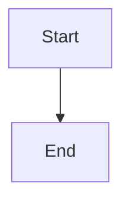

# Topic artifact templates

Use the relevant section for each phase. Remove prompts that do not apply; do not fill sections with invented content.

## `01-research.md`

```markdown
# <Topic>: research

## Status

- Phase: Research
- Topic:
- Date:
- Temporal Server:
- Go SDK:

## Question

## Scope

### In scope

### Out of scope

## Definitions and desired guarantees

## Industry patterns

## Temporal primitives and semantics

## Responsibility boundaries

| Concern | Temporal | Workflow code | Activity code | Worker/config | Product/infrastructure |
|---|---|---|---|---|---|

## Approaches

### Approach A

#### Pros

#### Cons

## Recommendation for the lab

## Misconceptions and non-features

## Risks and version-sensitive behavior

## Open questions

## Claims requiring experiments

## Sources
```

## `02-model.md`

```markdown
# <Topic>: example model

## Status

- Phase: Modeling
- Approval: Pending

## Learning objective

## Non-goals

## Scenario

## Actors and boundaries

## Inputs and outputs

## Identifiers and idempotency keys

## Diagram



## Happy path

## Failure and control matrix

| Scenario | Expected Temporal behavior | Expected application behavior | User-visible result |
|---|---|---|---|

## Progress and observability

## Expected event-history landmarks

## Automated tests

## Manual experiments

## Acceptance criteria

## Deferred alternatives

## Questions requiring agreement
```

## `03-implementation.md`

```markdown
# <Topic>: implementation and verification

## Status

- Phase: Implemented
- Verification:

## Code map

## Commands run

## Automated test results

## Runtime experiments

| Scenario | Workflow ID | Run ID | Expected | Observed | Result |
|---|---|---|---|---|---|

## Acceptance-criteria evidence

## Temporal UI links

## Differences from the approved model

## Known limitations
```

## `04-review.md`

```markdown
# <Topic>: review

## Pattern from first principles

## Why this design

## Alternatives and tradeoffs

## Guarantee boundaries

## Replay and determinism

## Retry and idempotency

## Failure and cancellation

## Scaling and history implications

## Observability and debugging

## Testing strategy

## Production hardening

## Scenario questions

## Rules of thumb

## Misconceptions corrected

## Remaining questions and follow-ups
```
