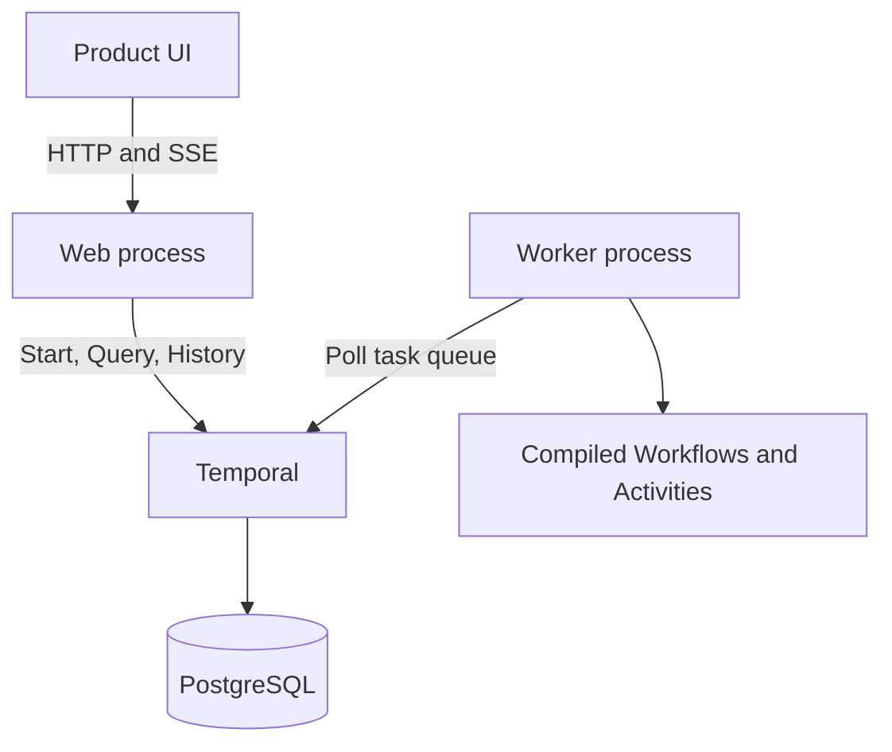

# Orchestration

A Temporal-backed base for durable business operations and AI workflows. It provides compiled workflow discovery, asynchronous starts, product-facing status, SSE updates, structured failures, and a generic UI.

This repository is currently a source-extension lab, not a runtime plugin platform. Adding a Workflow means changing and rebuilding this Go module.

## Run locally

Prerequisites: Docker with Compose.

```sh
cp .env.example .env
docker compose up --build
```

Open:

- Product UI: [http://localhost:8090](http://localhost:8090)
- Temporal UI: [http://localhost:8234](http://localhost:8234)

Select **Greeting**, keep the example input, and start the run. The product UI streams status while Temporal UI exposes the execution History.

Stop the stack with:

```sh
docker compose down
```

## Runtime



- `cmd/web` serves the UI and API. It is a Temporal client, not a Worker.
- `cmd/worker` registers and executes all Workflows and Activities.
- Temporal owns execution state and History.
- PostgreSQL stores Temporal state; there is no application run database yet.
- Protobuf defines top-level Workflow requests, results, status, and failures.

## Documentation

| Document | Use it when |
|---|---|
| [Architecture](docs/architecture.md) | You need the runtime boundaries and execution lifecycle |
| [Adding a Workflow](docs/adding-a-workflow.md) | You are adding business Workflows and Activities |
| [Execution semantics](docs/execution-semantics.md) | You need branching, fan-out, failure, or control behavior |
| [Data and artifacts](docs/data-and-artifacts.md) | Work produces durable side effects or large outputs |
| [HTTP API](docs/http-api.md) | You are building another API client or UI |

## Current boundaries

The supplied Compose stack is for local development. The project does not yet provide authentication, tenant isolation, a public extension SDK, dynamic Workflow installation, production deployment manifests, or user-facing control APIs such as cancel and retry.

Run the Go checks with:

```sh
go test ./...
```
