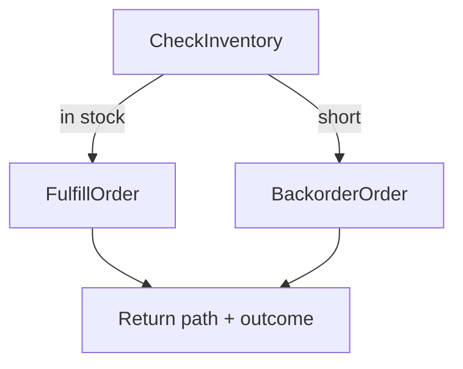

# Conditional branch

## Use case

An order Workflow must fulfill or backorder based on inventory observed at runtime.

1. Workflow input is the order (`order_id`, `sku`, `quantity`).
2. `CheckInventory` runs and returns how much stock is available (runtime condition).
3. The Workflow branches on that result:
   - stock covers the quantity → run `FulfillOrder` only
   - stock is short → run `BackorderOrder` only

Exactly one of the two path Activities executes. The branch is driven by a runtime Activity result, not by a toy classifier and not by calling the same Activity with different names.

For this lab, `available_stock` is supplied on the request as a fixture that `CheckInventory` "reads". In production that value would come from an inventory service inside the Activity.

## Model

Execution:

1. Validate order fields and non-negative stock/quantity.
2. Run `CheckInventory` with sku, requested quantity, and observed stock.
3. If `available_stock >= quantity`, execute `FulfillOrder`.
4. Else execute `BackorderOrder` with the shortfall.
5. Return which path ran, the inventory snapshot, and only the matching path outcome.

## Cases

| Case | What happens | Expected result |
|---|---|---|
| Fulfill | `available_stock >= quantity` | Path is fulfill; only `FulfillOrder` runs |
| Backorder | `available_stock < quantity` | Path is backorder; only `BackorderOrder` runs |
| Boundary | `available_stock == quantity` | Fulfill path |
| Runtime branch | Inventory Activity completes first | Path Activity is chosen from its result |
| Exactly one path | One inventory check + one path Activity | History has two Activity completions |
| Validation | Missing order fields or negative numbers | Non-retryable validation failure; no path Activity |

## Acceptance criteria

- Catalog lists `conditional-branch` without a new HTTP handler.
- Worker registers `CheckInventory`, `FulfillOrder`, and `BackorderOrder`.
- Fulfill and backorder cases return different path outcomes and different Activity types in history.
- Invalid requests fail with structured validation errors.
- Execution is inspectable from the Temporal UI link in the web UI.
