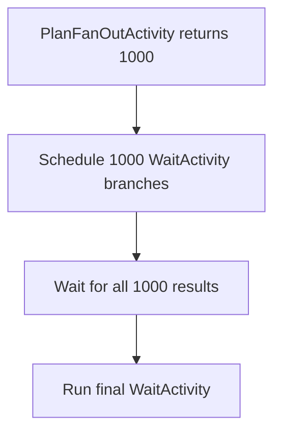

# Dynamic fan-out to 1,000 Activities

## Use case

An upstream `PlanFanOutActivity` returns the number of branch Activities to create. For this experiment it returns `1000`.

The Workflow must use that runtime result to schedule 1,000 `WaitActivity` executions, wait for every result, and then run one final `WaitActivity`.

This tests dynamic DAG construction. The fan-out size is not hardcoded into the Workflow loop; it comes from the upstream Activity result.

## Model

Execution:

1. Run `PlanFanOutActivity` and wait for its result.
2. Read `FanOutCount` from the result.
3. Loop from `0` to `FanOutCount - 1` and schedule each `WaitActivity` without calling `Get` inside the scheduling loop.
4. Store all 1,000 Futures.
5. In a second loop, call `Get` for every Future and collect its result.
6. Run `finalize` only after all branch Futures resolve successfully.
7. Return a summary containing planned count, completed count, timing, and final result.

Each branch uses a unique name and Activity ID such as `branch-0000` through `branch-0999` and simulates one second of work.

Scheduling 1,000 Activities does not guarantee that 1,000 execute simultaneously. Actual execution concurrency is limited by available workers and worker configuration. This experiment measures the behavior without adding concurrency tuning.

## Cases

| Case | What happens | Expected result |
|---|---|---|
| Runtime DAG size | The planning Activity returns `1000` | The Workflow creates exactly 1,000 branch Futures |
| Fan-out | All branch Activities are scheduled before the Workflow waits for results | Many branches overlap instead of running sequentially |
| Unique nodes | Every branch has a unique name and Activity ID | All 1,000 executions can be distinguished in Temporal history |
| Fan-in | The Workflow resolves every branch Future | Completed branch count is exactly 1,000 |
| Final dependency | `finalize` is scheduled after all branch results are collected | `finalize` starts only after the last branch completes |
| Execution summary | The Workflow completes | Result reports planned count, completed count, elapsed time, and final timing |

## Acceptance criteria

- `PlanFanOutActivity` returns a fan-out count of 1,000.
- The Workflow schedules exactly 1,000 branch `WaitActivity` executions from that result.
- The Workflow does not call `Get` while scheduling branches.
- Branch Activity executions overlap in time.
- Every branch completes successfully.
- `finalize` begins only after all 1,000 branches finish.
- The Workflow result reports `PlannedCount = 1000` and `CompletedCount = 1000`.
- Temporal reports the Workflow as completed.
- We capture total runtime, Workflow history length/size, Workflow ID, Run ID, and a direct Temporal UI link.
