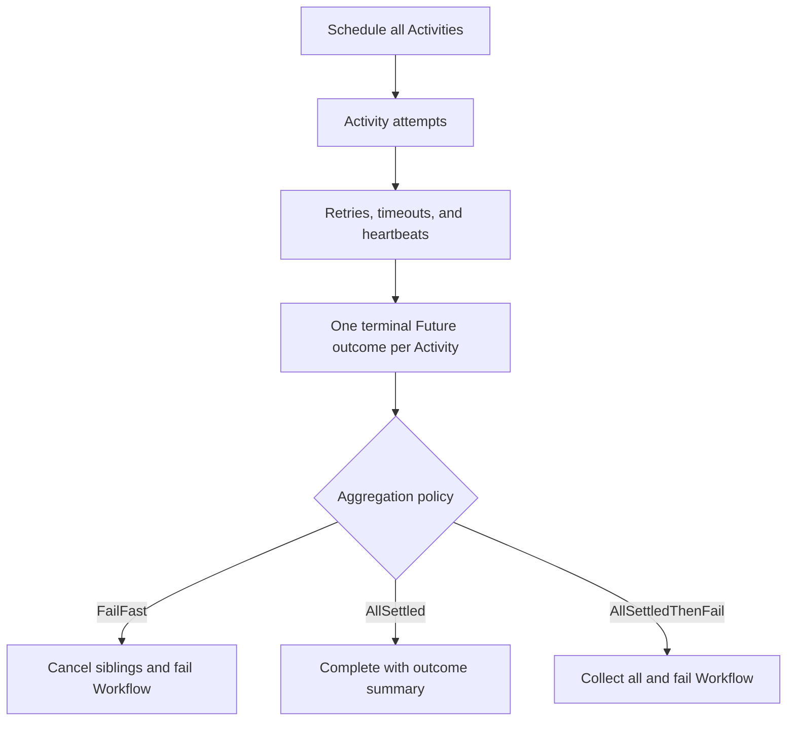

# Fan-out failure and aggregation policies

## Use case

Run a configurable group of Activities in parallel and apply one of three policies to their final outcomes:

1. `FailFast` — fail on the first terminal Activity error and cancel unfinished siblings.
2. `AllSettled` — allow every Activity to finish and complete the Workflow with successes and failures in its result.
3. `AllSettledThenFail` — allow every Activity to finish, collect all outcomes, and then fail the Workflow if any Activity failed.

Every Activity keeps its own Retry Policy, timeouts, heartbeat behavior, and cancellation handling. Those settings determine the Activity Future’s final outcome. The aggregator only handles final outcomes.

## Model



The implementation has two reusable responsibilities:

- **Fan-out scheduler:** schedules every Activity before waiting and retains its Future, index, and Activity ID.
- **Aggregator:** observes Future outcomes and applies the selected policy.

The experiments use one reusable `FaultInjectionActivity`. It is a test harness, not a base class for production Activities.

It supports explicit deterministic modes:

- `success`
- `retryable-failure`
- `non-retryable-failure`
- `panic`
- `start-to-close-timeout`
- `heartbeat-timeout`
- `wait-for-cancellation`

It also supports seeded outcome probabilities for large fan-out experiments. The seed is combined with Activity ID and attempt number so runs are reproducible while branches and retry attempts can receive different outcomes. Exact correctness tests always use an explicit mode rather than probability.

The Activity itself returns success, retryable Application Errors, non-retryable Application Errors, or panics. Temporal must generate real timeout and cancellation outcomes:

- Start-to-close timeout: the Activity remains running beyond `StartToCloseTimeout`.
- Heartbeat timeout: the Activity stops heartbeating beyond `HeartbeatTimeout`.
- Schedule-to-close timeout: retries continue until the overall timeout expires.
- Cancellation: the Workflow/client requests cancellation and the Activity observes it through heartbeat and `ctx.Done()`.
- Schedule-to-start timeout: a separate Task Queue has no available worker; the Activity function never starts.
- Worker crash: the worker process is killed externally; an Activity panic is not treated as a worker crash.

Each branch produces a structured outcome containing:

- Activity ID and input index
- Status: completed, failed, or canceled
- Successful result when available
- A normalized failure kind—application, timeout, canceled, panic, or unknown—plus useful details
- Final attempt number

Activity-level processing happens before aggregation:

```text
Activity attempt
    -> Retry Policy, timeouts, and heartbeats
    -> Final Activity outcome
    -> Aggregation policy
    -> Workflow outcome
```

A retryable attempt failure remains internal to the Activity Execution. The aggregator sees success if a later attempt succeeds. It sees an error only after retries are exhausted, a non-retryable error occurs, a final timeout occurs, or cancellation completes.

Cancellation is the intentional interaction between the layers. `FailFast` uses a shared cancelable Workflow context. On the first terminal failure, it requests cancellation of unfinished siblings. Activities must cooperate with context cancellation and heartbeat where required.

Successful Activities are not rolled back when another branch fails. Compensation is a separate policy and is not included here.

## Cases

| Case | What happens | Expected result |
|---|---|---|
| Retry then success | One Activity fails on early attempts and later succeeds within its Retry Policy | Aggregator records one success; intermediate attempt failures do not fail the fan-out |
| Retries exhausted | One Activity reaches its maximum attempts or total timeout | Its Future returns a terminal error to the aggregator |
| Non-retryable failure | One Activity returns a non-retryable Application Error | Its Future fails without another retry |
| Heartbeat timeout then success | A long-running attempt misses its heartbeat, retries, and later succeeds | Aggregator records success from the final attempt |
| Start-to-close timeout | An Activity runs longer than one attempt timeout | Temporal creates a timeout; Retry Policy retries or returns a terminal timeout |
| Panic | An Activity panics | Go SDK reports a Panic Failure; Retry Policy determines whether another attempt runs |
| Cancellation | The Workflow cancels a heartbeating Activity | Activity observes cancellation and its Future resolves as canceled |
| Schedule-to-start timeout | An Activity is routed to a Task Queue with no worker | Temporal times out the queued Task without running Activity code |
| Worker crash | The worker process is killed during an Activity attempt | Temporal detects loss through heartbeat or start-to-close timeout and applies Retry Policy |
| Fail fast | One branch reaches a terminal failure while siblings are unfinished | Aggregator cancels unfinished siblings, skips finalization, and the Workflow fails |
| All settled | Some branches succeed and some fail | Every branch is allowed to finish; Workflow completes with a partial-result summary |
| All settled then fail | Some branches succeed and some fail | Every branch is allowed to finish; Workflow returns an aggregate error and fails |
| All succeed | Every Activity eventually succeeds | All three policies complete successfully with the same successful result set |
| Successful work before failure | Some Activities complete before another branch fails | Completed external effects remain; Temporal does not roll them back |

## Acceptance criteria

- All Activities are scheduled before aggregation begins.
- Each scheduled Activity has one Future representing its complete retry chain.
- Retryable attempt failures are handled by Temporal before the aggregator receives a terminal outcome.
- A later successful retry is reported as one successful branch outcome.
- A non-retryable error reaches the aggregator without additional attempts.
- Explicit fault modes produce reproducible tests.
- Seeded probability mode reproduces the same outcomes for the same Activity IDs, attempts, and seed.
- Timeout tests use real Temporal timeouts rather than returning synthetic timeout errors from Activity code.
- Cancellation tests use a real cancellation request rather than randomly returning cancellation.
- Worker-crash tests kill the worker process rather than using an Activity panic.
- Aggregated results contain serializable normalized failure data rather than raw Go `error` interfaces.
- `FailFast` reacts in completion order rather than input order.
- `FailFast` requests cancellation of unfinished siblings and returns a Workflow error.
- Cancellation-aware Activities stop and surface canceled outcomes.
- `AllSettled` waits for every Future and returns `nil` as the Workflow error, so Temporal marks the Workflow completed.
- The `AllSettled` result includes planned, succeeded, failed, and canceled counts plus per-Activity outcomes.
- `AllSettledThenFail` waits for every Future and returns an aggregate Workflow error when failures exist.
- When all Activities succeed, all policies return successful results.
- Temporal UI shows Activity attempts, final Activity failures or cancellations, and the resulting Workflow status.
- Tests verify retry success, retry exhaustion, non-retryable failure, fail-fast cancellation, partial completion, aggregate failure, and complete success.
