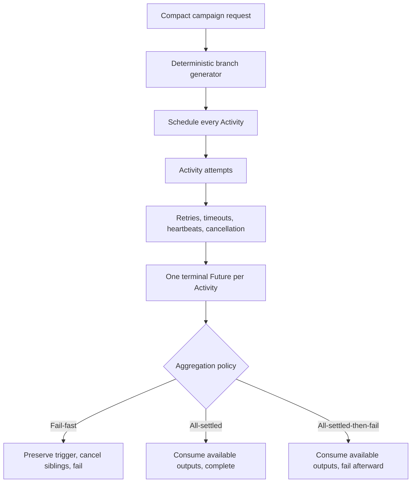

# Fan-out failure and aggregation policies

## Purpose

This experiment runs up to 1,000 fault-injection Activities in parallel and compares three policies for handling their terminal outcomes:

1. `FailFast` — fail on the first terminal Activity error and cancel unfinished siblings.
2. `AllSettled` — allow every Activity to finish and complete the Workflow with a compact aggregate over the available successful outputs and failures.
3. `AllSettledThenFail` — allow every Activity to finish, produce the same compact aggregate, and then fail the Workflow when any Activity failed.

Each Activity keeps its own Retry Policy, timeouts, heartbeat behavior, and cancellation handling. Those settings determine the Activity Future's terminal outcome. The aggregation policy only handles terminal Future outcomes.

The experiment uses the existing `FaultInjectionActivity`. It is a fault harness, not a production Activity base class.

## Execution model



All Activities are scheduled before aggregation begins. A retryable attempt failure remains internal to one Activity Execution. The aggregator sees success if a later attempt succeeds and sees an error only after retries are exhausted, a non-retryable error occurs, a terminal timeout occurs, or cancellation completes.

Successful Activities are not rolled back when another branch fails. Compensation is a separate policy and is not part of this experiment.

## Compact request

The UI and Workflow do not exchange 1,000 branch specifications for a generated campaign.

The campaign request contains:

```text
policy
campaign type
activity count
seed
background outcome probabilities for a mixed campaign
```

Campaign types are versioned so a seed identifies a specific generator model:

```text
FAULT_CAMPAIGN_ALL_SUCCESS_V1
FAULT_CAMPAIGN_MIXED_V1
```

Example mixed request:

```json
{
  "policy": "AGGREGATION_POLICY_ALL_SETTLED",
  "campaign": {
    "type": "FAULT_CAMPAIGN_MIXED_V1",
    "activityCount": 1000,
    "seed": "4815162342",
    "backgroundProbabilities": {
      "success": 82,
      "retryableFailure": 8,
      "nonRetryableFailure": 3,
      "panic": 2,
      "startToCloseTimeout": 3,
      "heartbeatTimeout": 2
    }
  }
}
```

Validation rules:

- All-success count is from 1 through 1,000.
- Mixed count is from 6 through 1,000 because six branches are reserved for guaranteed coverage.
- Probability values cannot be negative.
- Mixed background probabilities must total exactly 100.
- All-success does not accept mixed background probabilities.
- A request uses either a generated campaign or the existing explicit branch fixture, never both.

The explicit branch fixture remains useful for small exact fault cases. The product UI uses generated campaigns.

`finalize_duration` is not part of generated campaigns. A timed wait is not real aggregation.

## UI input

The fan-out experiment UI exposes:

- Campaign.
- Activity count, defaulting to 1,000.
- Seed.
- The six background probability weights for the mixed campaign.
- Policy for an individual run.
- `Run selected policy`.
- `Run all three policies`.

Running the matrix starts three independent main Workflow Executions through the existing asynchronous start API. It sends the same campaign, count, seed, and probability profile with a different policy for each run. It does not create a parent or Child Workflow.

Existing SSE reconciliation tracks and renders the three Workflow ID and Run ID pairs independently.

## Deterministic campaign generator

The generator runs in Workflow code and is a pure function of:

```text
campaign type + activity count + seed + probabilities
```

It creates stable, unique Activity IDs:

```text
fault-000000
fault-000001
...
fault-000999
```

Policy is deliberately excluded from Activity ID generation. The same campaign request under each policy therefore uses the same Activity IDs, explicit coverage branches, probability selections, Retry Policy, and timeout configuration.

The existing fault harness combines seed, Activity ID, and attempt number when choosing a probabilistic outcome. Replaying a Workflow reconstructs the same schedule, while separate policy runs with the same campaign receive the same per-attempt selections.

## Campaigns

### All-success V1

Every generated Activity receives:

```text
mode: success
work duration: 300ms
heartbeat interval: 100ms
```

No random probability is involved.

Expected result for all three policies:

```text
planned: 1000
succeeded: 1000
failed: 0
canceled: 0
```

All policies complete and produce the same semantic aggregate digest. The normal path is guaranteed by this campaign rather than relying on the mixed campaign to randomly produce 1,000 successes.

### Mixed V1

Six branches guarantee critical coverage:

| Activity ID | Behavior |
|---|---|
| `fault-000000` | Immediate non-retryable failure and early fail-fast trigger candidate |
| `fault-000001` | Retryable failure on attempt 1, then success on attempt 2 |
| `fault-000002` | Retryable failure through attempt 3; retries exhausted |
| `fault-000003` | Panic on every attempt; retries exhausted |
| `fault-000004` | Start-to-Close timeout on every attempt |
| `fault-000005` | Heartbeat timeout on every attempt |

The remaining branches use the request's background probability profile. The default profile is:

```text
success                  82
retryable failure         8
non-retryable failure     3
panic                     2
Start-to-Close timeout    3
heartbeat timeout         2
                         ---
                         100
```

Probabilistic branches use `FailUntilAttempt = 1`. A retryable outcome fails the first attempt, while a later attempt can succeed or select another deterministic outcome. The explicit retry-exhaustion branch remains necessary because exhaustion must not depend on chance.

Ordinary branches perform cancellable, heartbeating work. An early terminal failure under fail-fast can therefore cancel in-flight or not-yet-started siblings. The shared workload does not contain an indefinitely waiting branch because that would prevent the all-settled policies from finishing.

The six guaranteed branches slightly affect the overall observed distribution. The configured probabilities apply only to the background branches.

## Activity policy and timings

Every generated Activity uses:

```text
MaximumAttempts:         3
InitialInterval:         100ms
BackoffCoefficient:      2
MaximumInterval:         500ms
StartToCloseTimeout:     2s
HeartbeatTimeout:        500ms
ScheduleToCloseTimeout:  2m
WaitForCancellation:     true
```

Generated input timings are:

```text
normal work:        300ms
heartbeat interval: 100ms
injected stall:       3s
```

Normal work finishes below Start-to-Close and heartbeats comfortably below Heartbeat timeout. A three-second stall creates real Temporal timeout events. `MaximumAttempts` is the intended retry-exhaustion boundary. The generous Schedule-to-Close timeout prevents normal queue pressure from accidentally becoming the failure under test.

If the real stack exposes a server, pending-Activity, or queue limitation at 1,000 Activities, that is recorded as experiment evidence rather than hidden by silently changing the model.

## Policy semantics

### Fail-fast

- React to the first terminal failure observed by the Workflow Selector.
- When several Futures are already ready in one Workflow Task, accept the Selector's deterministic registration-order choice rather than claiming exact History completion order.
- Preserve the triggering Activity ID, input index, and normalized failure.
- Request cancellation of unfinished siblings.
- Wait for requested sibling cancellation to settle so counts are accurate.
- Preserve results that completed before the trigger.
- Do not run or claim complete full-data aggregation when required inputs are missing.
- Fail the Workflow with compact structured details.

### All-settled

- Give every Activity its complete retry chain.
- Observe every terminal Future.
- Consume every available successful branch output.
- Include every terminal failure in compact breakdown counts.
- Produce a complete aggregate over the available successful output set.
- Complete the Workflow even when some branches failed.

### All-settled-then-fail

- Perform the same collection and aggregation as all-settled.
- Preserve the compact aggregate in Application Error details.
- Fail afterward with `FAN_OUT_AGGREGATE_FAILURE` when any branch failed or was canceled.
- Produce the same counts and aggregate digest as all-settled for the same campaign.

## Failure normalization

A terminal Activity failure preserves useful, serializable data where Temporal exposes it:

- Activity ID.
- Input index.
- Failure kind.
- Application failure type.
- Timeout type.
- Non-retryable flag.
- Safe message.
- Final attempt when available.

The compact breakdown distinguishes:

- Retry exhaustion.
- Non-retryable application failure.
- Panic.
- Start-to-Close timeout.
- Heartbeat timeout.
- Cancellation.
- Unknown failure.

Fail-fast preserves its exact triggering failure. The aggregate result retains at most one representative sample per normalized category instead of returning every detailed outcome.

## Real aggregation without an unbounded payload

Counters do not replace aggregation input. The Workflow consumes each successful `FaultActivityResult` returned by a terminal Future.

For this experiment, the semantic aggregate uses stable fields from each successful output:

```text
input index
Activity ID and result name
outcome
successful attempt
```

Each successful branch produces a fixed-size digest. The Workflow combines those digests in input order into one semantic aggregate digest. Wall-clock timestamps are excluded because they are execution metadata and would make equivalent policy runs produce different semantic aggregates.

The compact result contains:

```text
policy, campaign, and seed
planned, succeeded, failed, and canceled counts
first-attempt and after-retry success counts
complete aggregate flag
consumed successful output count
semantic aggregate digest
fixed failure breakdown counts
bounded representative samples
optional fail-fast trigger
start, finish, and elapsed time
```

It does not contain an unbounded `repeated ActivityOutcome` field.

For all-settled and all-settled-then-fail, the Workflow retains only fixed-size per-index digests until it can combine them deterministically. Detailed outcome samples remain bounded by the known normalized categories. For fail-fast, collection produces counts and trigger details but no complete aggregate.

This experiment does not need SQLite or RustFS because each fault result is small. It never constructs one large aggregation Activity input. A later storage-backed aggregation experiment will pass compact SQLite or RustFS references when real branch data is large.

Temporal History still contains individual Activity events and their individual payloads. Compact Workflow output prevents a single unbounded fan-in result payload; it does not eliminate History growth. History growth is measured as part of the experiment.

## Expected cases

| Case | Expected observation |
|---|---|
| Retry then success | One terminal success with attempt greater than one; intermediate failures do not fail the fan-out |
| Retries exhausted | One terminal application failure after the configured maximum attempts |
| Non-retryable failure | Terminal failure without another attempt |
| Start-to-Close timeout | Temporal creates real Start-to-Close timeout attempts and eventually a terminal timeout |
| Heartbeat timeout | Temporal creates real Heartbeat timeout attempts and eventually a terminal timeout |
| Panic | Go SDK reports Panic Failure and Retry Policy applies |
| Fail-fast cancellation | First terminal failure observed by the Workflow triggers sibling cancellation and Workflow failure |
| All-settled partial result | Every Future settles, successful outputs are aggregated, and Workflow completes |
| All-settled aggregate failure | Every Future settles, successful outputs are aggregated, and Workflow fails afterward |
| All succeed | Every Activity succeeds and all three policies return the same successful aggregate |
| Successful work before failure | Completed results remain completed; Temporal does not roll them back |

Schedule-to-start timeout and external Worker crash remain separate real-stack fault experiments. A panic is not treated as a Worker crash.

## Acceptance criteria

Six real Workflow Executions are run: all three policies for all-success V1 and all three policies for mixed V1.

### All-success matrix

- Each run plans exactly 1,000 Activities.
- Each run completes with 1,000 successes, zero failures, and zero cancellations.
- Each aggregate consumes exactly 1,000 successful outputs.
- All three runs produce the same semantic aggregate digest.

### Mixed all-settled

- Workflow completes.
- All 1,000 terminal Futures are observed.
- Retry-then-success, retry exhaustion, non-retryable failure, panic, Start-to-Close timeout, and heartbeat timeout are present.
- Every available successful output is consumed by the aggregate.

### Mixed all-settled-then-fail

- All 1,000 terminal Futures are observed.
- Counts and semantic aggregate digest match mixed all-settled.
- Compact aggregation completes before the Workflow fails.
- The compact result remains available through structured Application Error details.

### Mixed fail-fast

- The first terminal failure observed by the Workflow Selector triggers fail-fast behavior.
- If several Futures are ready in one Workflow Task, the deterministic selected failure is not claimed to be the earliest History completion event.
- Its Activity identity and normalized failure are preserved.
- Unfinished siblings are canceled.
- The canceled count is greater than zero.
- The Workflow fails and does not claim a complete aggregate.

### Payload and live status

- No campaign result contains all per-Activity outcomes.
- The serialized terminal result or structured error details remain below 64 KiB.
- SSE progress reports planned, scheduled, in-flight, succeeded, failed, and canceled counts without browser polling.
- The UI can start one policy or all three policies with the same campaign configuration.

### Evidence captured per run

- Workflow ID and Run ID.
- Policy and campaign.
- Temporal UI link.
- Final Workflow status.
- Planned, succeeded, failed, and canceled counts.
- Retry-success and retry-exhaustion evidence.
- Timeout and cancellation types.
- Aggregation behavior and digest.
- Runtime.
- History event count.
- History byte size.
- Terminal result or error-detail payload size.
