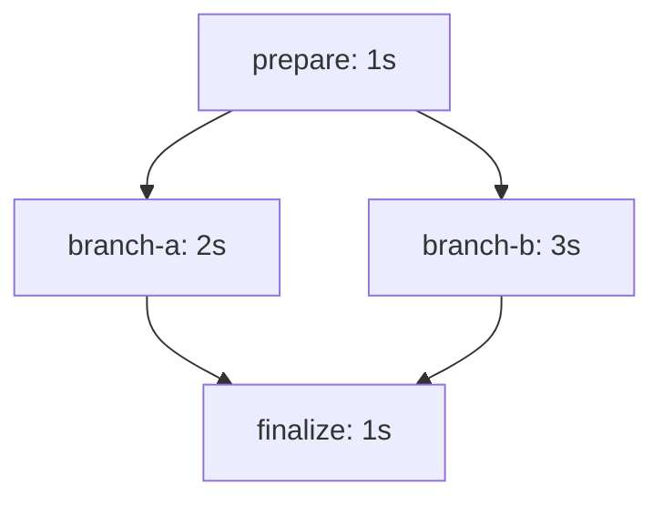

# Simple diamond DAG

## Use case

Build a four-node diamond DAG using one reusable `WaitActivity`. The Activity simulates work, logs start and finish times, and returns timing information so we can verify execution order and parallelism.

The same Activity is invoked with four names and durations:

- `prepare`: 1 second
- `branch-a`: 2 seconds
- `branch-b`: 3 seconds
- `finalize`: 1 second

`WaitActivity` is for experiments that need to occupy an Activity worker and simulate real work. A production Workflow that only needs a delay should use Temporal's durable `workflow.Sleep` or timer instead.

## Model

Execution:

1. Run `prepare` and wait for it to complete.
2. Start `branch-a` and `branch-b` without waiting between starts.
3. Wait for both branch results.
4. Run `finalize` only after both branches complete.
5. Return all four timing results and total Workflow duration.

`WaitActivity` accepts a name and duration. It returns its name, Activity attempt, start time, finish time, and elapsed duration. Its wait must respect context cancellation.

## Cases

| Case | What happens | Expected result |
|---|---|---|
| Initial dependency | `prepare` runs before either branch | Neither branch starts before `prepare` finishes |
| Fan-out | `branch-a` and `branch-b` are scheduled after `prepare` | Their execution times overlap |
| Fan-in | `finalize` depends on both branches | It starts only after both branches finish |
| Reusable wait Activity | All four nodes invoke the same Activity type with different inputs | Logs and returned timing data identify each node |
| End-to-end timing | Durations are 1s, 2s/3s in parallel, and 1s | Workflow takes roughly 5 seconds rather than 7 seconds |

## Acceptance criteria

- Temporal records one successful Workflow Execution.
- The Workflow history contains four successful Activity Executions.
- `prepare` finishes before `branch-a` and `branch-b` start.
- `branch-a` and `branch-b` overlap in time.
- `finalize` starts after both branches finish.
- Every Activity log includes its name, attempt, start time, finish time, and elapsed duration.
- The Workflow result contains timing results for all four nodes.
- The measured end-to-end duration demonstrates parallel execution, with reasonable scheduling tolerance around the expected five seconds.
- The execution can be inspected from a direct Temporal UI link.
